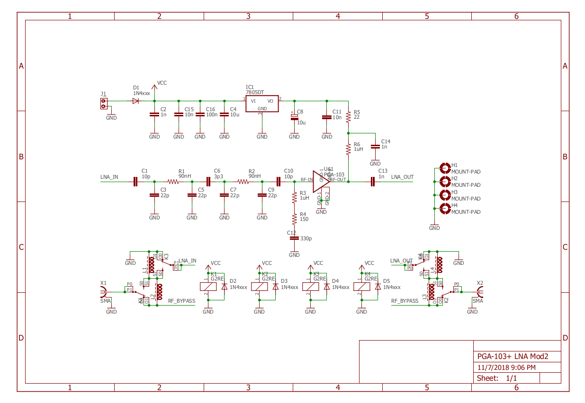
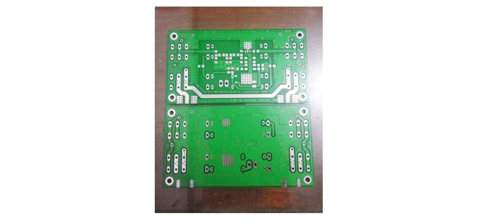
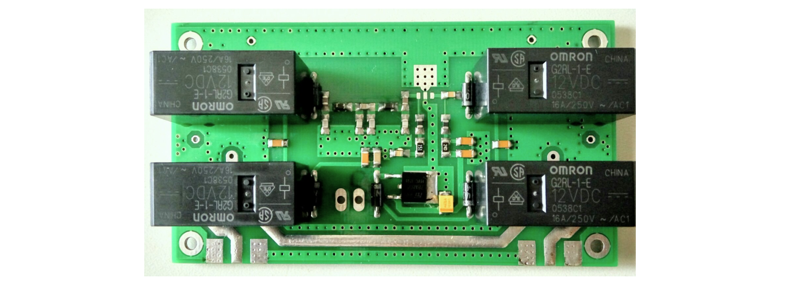
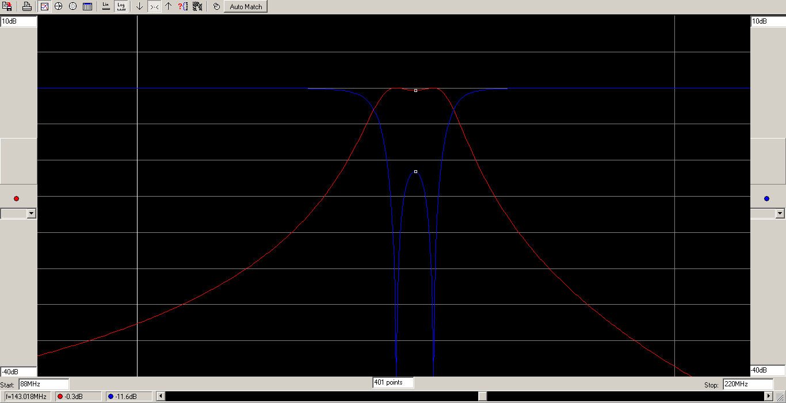

# MMIC VHF Low Noise Amplifier
VHF Low Noise Amplifier Circuit &amp; PCB using common MMIC. This unit is capable upto 1kW at 2m-band and powered by +12V supply thru separate cable (hi-power bias tee is not implemented). MMIC input is protected by A BPF, therefore due to the BPF insertion loss, the input NF is not extremely good, (1 dB NF approx.). All the Eagle and Gerber files are included.

## Schematic

## PCB (photos)
* Unpopulated

* Populated. The input port is at near the lower right relay and the output port is at near the lower left relay.

## BPF Response
BPF simulation file (using RFSim99) is included also.
Predicted performance:
* **S21 -3dB from 135.67MHz - 150.07MHz**
* **S21 -10dB from 131.1MHz - 154.5MHz**
* **S21 -0.02dB and S11 -23.86dB at 139.1MHz** (WXSat band)
* **S21 -0.31dB and S11 -11.59dB at 143.02MHz** (BPF Center Frequency)
* **S21 -0.21dB and S11 -13.17dB at 144.3MHz** (EME Band)
* **S21 -0.04dB and S11 -20.69dB at 145.8MHz** (2m AMSAT Band)
* **FM Broadcast band rejection is better than -28dB (S21) at 108MHz**

## Contributing
1. Fork it [https://github.com/handiko/VHF-LNA/fork](https://github.com/handiko/VHF-LNA/fork)
2. Create new branch (`git checkout -b add-blah-blah`)
3. Do some editing / create new feature
4. Commit your works (`git commit -m "Adding some blah blah blah.."`)
5. Push to the branch (`git push -u origin add-blah-blah`)
6. Create a new Pull Request
